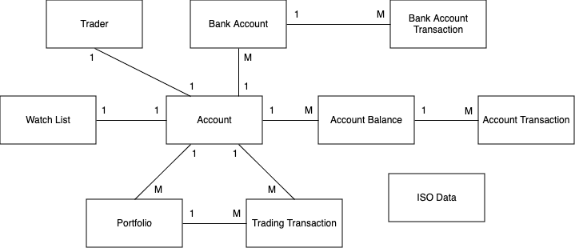

# Virtual Trading

Java web application simulating online stock trading. 
First developed in Y2008, revamped in Y2024. 
Compatible with Java 17. 

The available features can be found <a href="docs/features.txt">here</a>. 

The application follows a 3-tiered architecture: 
MySQL database for the data layer. Database scripts can be found in <a href="db">db folder</a>. 
REST APIs for the service (business logic) layer. The available endpoints can be found <a href="docs/endpoints.txt">here</a>. 
Freemarker for the user interface (UI) layer. 

Spring Boot v3 as base with embedded Tomcat server. 
A &quot;modified&quot; Yahoo Finance API library for fetching stock prices. (Changes <a href="https://github.com/yktsang01/YahooFinanceAPI">here</a>.) 
OpenAPI v3 for Swagger. 
JSON web token (JWT) for API authentication &amp; authorization. 

Domain model: 

